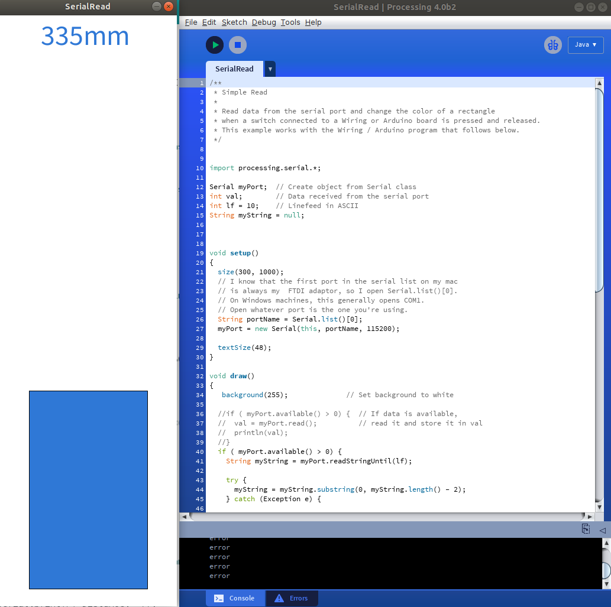

# vl53l1x-arduino-processing
Read data output of VL53L1X time-of-flight (ToF) sensor with Arduino and visualize the result in Processing.

Arduino code: VL53L1X_simpletest

Processing code: SerialRead

